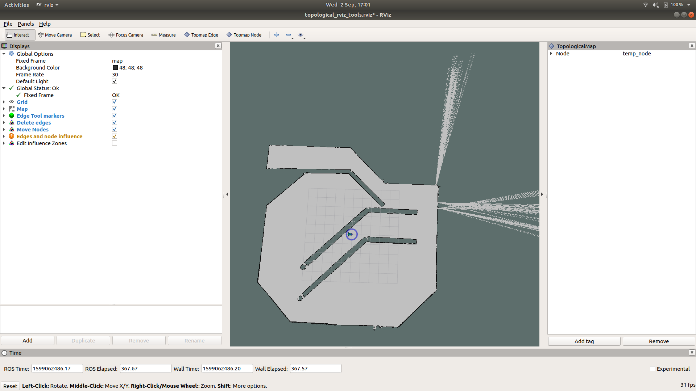
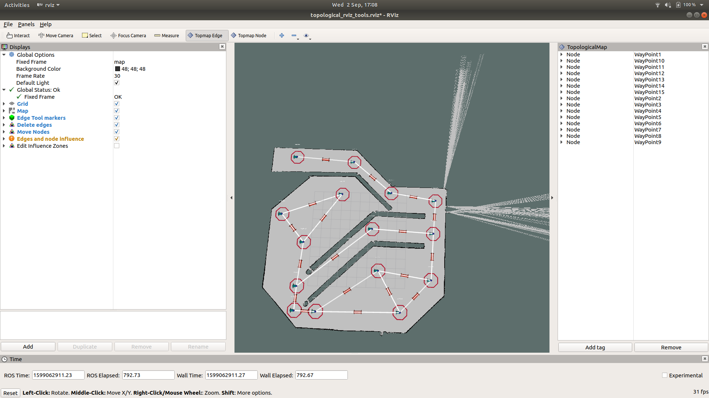
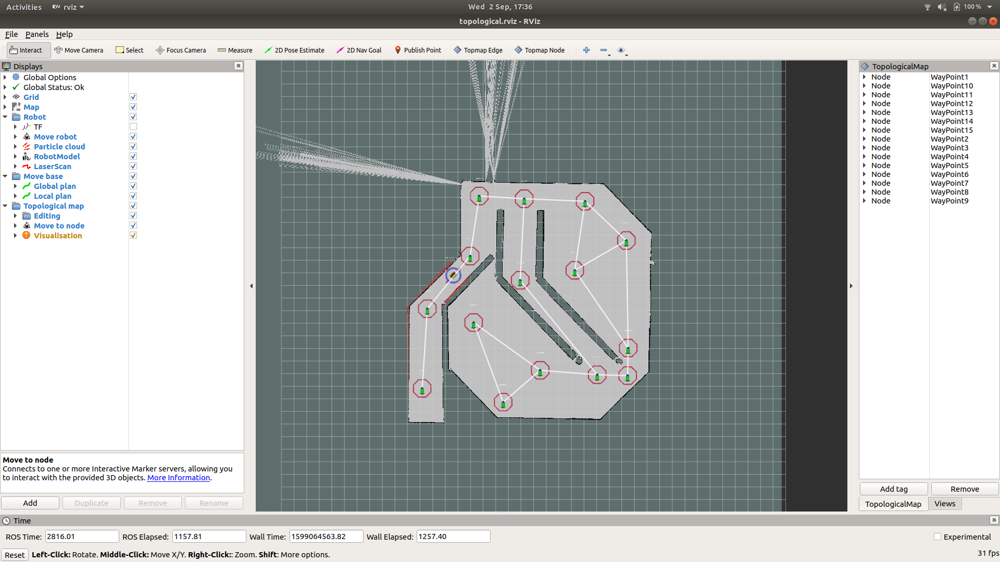

# Strands navigation example

This package is an example of how you might set up the strands navigation stack for use with a robot, using the clearpath jackal as an example. It includes usage of the topological mapping system.

The setup assumes the use of melodic, but should also work for kinetic.

## Jackal simulation setup

To start, you will need to install the jackal packages. 

```
sudo apt install ros-melodic-jackal-desktop ros-melodic-jackal-navigation
```

Then, you can start the gazebo simulation with

```
roslaunch jackal_gazebo jackal_world.launch front_laser:=true
```

You will see the jackal in a racing-track-like world.

Then, run amcl and move_base with

```
roslaunch jackal_navigation amcl_demo.launch
``` 

You can visualise and move the robot with rviz, by dragging the interactive markers or by using the 2d nav goal command.

```
roscd jackal_viz
rviz -d rviz/navigation.rviz
```

The `localization.rviz` config may also be useful.

## Setting up strands packages

We need to install the packages required by the strands navigation stack. These are all available through the lincoln buildfarm. Follow the instructions at https://github.com/LCAS/rosdistro/wiki#batch-install to set things up so you can install from it.

Once that's done, install the following packages

```
sudo apt install ros-melodic-strands-navigation ros-melodic-topological-navigation ros-melodic-topological-rviz-tools
```

## Making a topological map

To make a topological map we will use the topological rviz tools package. First, we need to create a directory for the mongodb database that will store the data. This can be anywhere you like.

```
mkdir ~/strands_test_db
```

To prepare, we need to first insert an empty map into the database. Start the database with

```
roslaunch mongodb_store mongodb_store.launch db_path:=/home/$USER/strands_test_db
```

Then, insert an empty map. Note that this script is missing from some of the release packages. If so, clone the repository at https://github.com/LCAS/topological_navigation, add it to a workspace and build, and it should be available.

```
rosrun topological_utils insert_empty_map.py jackal_race
```

Once that is done, we can start the topological rviz tools. Note that this will also run a mongodb_store so the one you started earlier will shut down.

```
roslaunch topological_rviz_tools strands_rviz_topmap.launch db_path:=/home/$USER/strands_test_db map:=`rospack find jackal_navigation`/maps/jackal_race.yaml topmap:=jackal_race standalone:=true
```

This will bring up an rviz window. See [topological_rviz_tools](https://github.com/LCAS/topological_navigation/tree/master/topological_rviz_tools) for more details about the components.



First, remove the `temp_node` using the panel on the right, and then using the node and edge tools, add nodes to the map and connect them with edges. The topological map will be saved in the database but you may also want to output it to yaml for convenience, which you can do with

```
rosrun topological_utils map_to_yaml.py jackal_race jackal_race.yaml
```

You will end up with something like



We now have all we need to try out the system

## Navigating on the topological map

Start the gazebo simulation following the instructions above.

Then, start the mongo database

```
roslaunch mongodb_store mongodb_store.launch db_path:=/home/$USER/strands_test_db
```

and run the topological navigation launch

```
roslaunch topological_navigation minimal_topological_navigation.launch map:=jackal_race move_base_planner:=move_base/TrajectoryPlannerROS
```

Start rviz and load the `topological.rviz` config found in this package.



To use the topological navigation from rviz, you can click the green arrows on the nodes and the robot will navigate there.