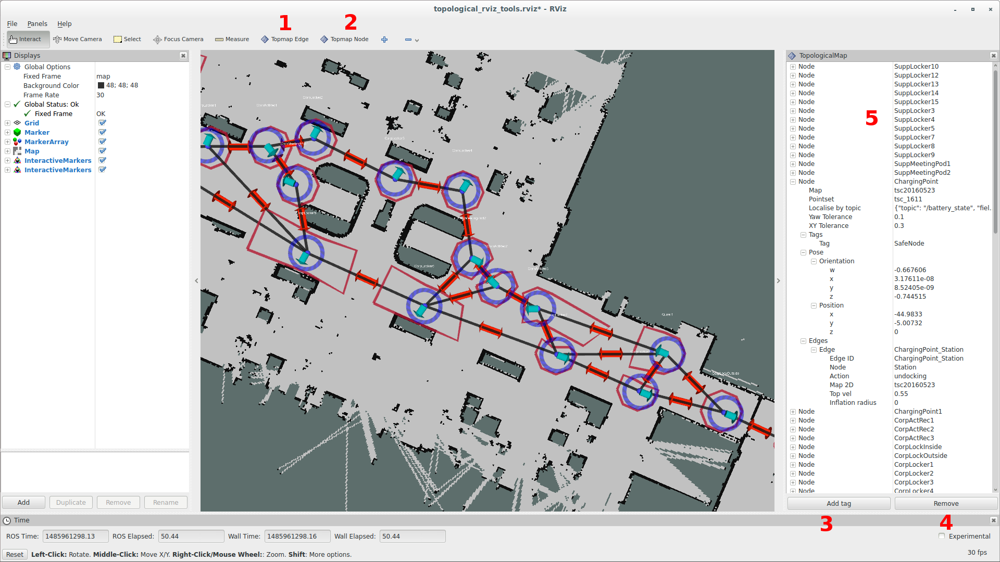

# topological_rviz_tools
Rviz tool for creating a STRANDS topological map

## Usage

This rviz toolset can be launched using

```sh
roslaunch topological_rviz_tools strands_rviz_topmap.launch map:=/path/to/map.yaml topmap:=topmap_pointset db_path:=/path/to/db
```

`map` specifies the `yaml` file for the map you are using, and `topmap` the
corresponding pointset that exists in the database. `db_path` is used to point
to the database you want to use.

When you launch with a database which contains a topological map, you should see
something like the following:



### 1. The edge tool

Use this tool to create edges between nodes. Left click to select the start point of
the edge, then click again to create an edge. The edge will be created between
the nodes closest to the two clicks, but only if there are nodes within some
distance of the clicks. Left clicking will create a bidirectional edge, whereas
right clicking will create an edge only from the node closest to the first click
to the second one. This tool stays on until you press escape.

The shortcut is `e`.

### 2. The node tool

This tool allows you to add nodes to the topological map. Click the tool and
then click on the map to add a node in that location. Edges will automatically
be added between the new node and any nodes in close proximity.

The shortcut is `n`.

### 3. Add tag button

This button allows you to add tags to nodes. You can select multiple nodes, and
the tag you enter in the dialog box will be added to all of them.

### 4. Remove button

With this button, you can remove edges, tags, and nodes from the topological
map. You can select multiple elements and they will all be removed at once.

### 5. Topological map panel

You can see all the elements of the topological map here. You can edit the
following elements:

- Node name
- Node pose
- Node tags
- Node yaw tolerance
- Node xy tolerance
- Edge action
- Edge velocity

Ctrl-click allows you to select multiple distinct elements. Shift-click will
select elements between the previously selected element and the current one.
